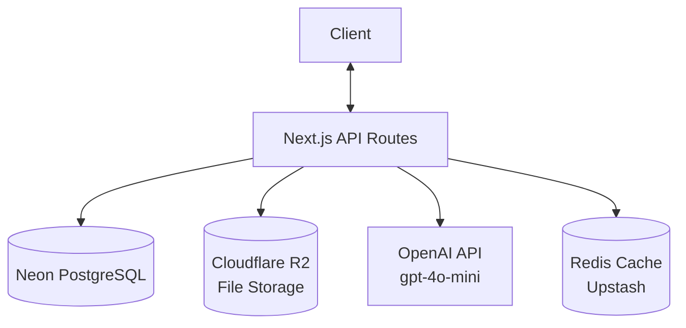
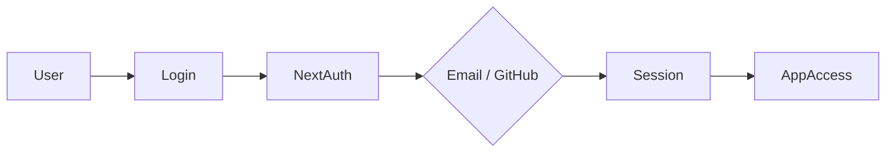
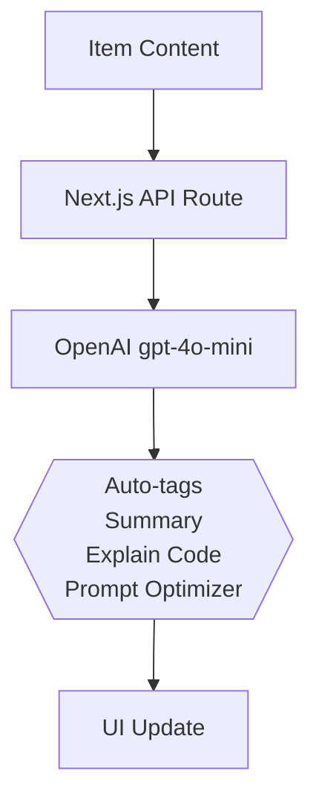
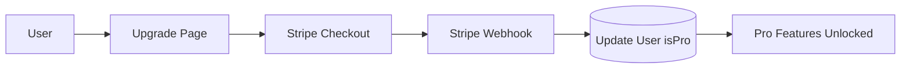

# 🗃️ DevStash — Project Overview

> **Store Smarter. Build Faster.**
> A centralized, AI-enhanced knowledge hub for developers.

---

## 📌 The Problem

Developers scatter their essentials across too many places:

| What          | Where it ends up              |
| ------------- | ----------------------------- |
| Code snippets | VS Code, Notion, GitHub Gists |
| AI prompts    | Chat histories                |
| Context files | Buried in project folders     |
| Useful links  | Browser bookmarks             |
| Documentation | Random local folders          |
| Commands      | `.txt` files, bash history    |
| Templates     | GitHub Gists, Google Drive    |

This creates **context switching**, **lost knowledge**, and **inconsistent workflows**.

**DevStash provides ONE searchable, AI-enhanced hub for all dev knowledge.**

---

## 👥 Target Users

| Persona                       | Primary Needs                             |
| ----------------------------- | ----------------------------------------- |
| 🧑‍💻 Everyday Developer         | Quick access to snippets, commands, links |
| 🤖 AI-First Developer         | Store prompts, workflows, context files   |
| 🎓 Content Creator / Educator | Save course notes, reusable examples      |
| 🏗️ Full-Stack Builder         | Patterns, boilerplates, API references    |

---

## ✨ Core Features

### A) Items & Item Types

Every saved resource is an **Item** with a built-in type:

| Type    | Icon  | Description                      |
| ------- | ----- | -------------------------------- |
| Snippet | `</>` | Code in any language             |
| Prompt  | `🤖`  | AI prompt templates              |
| Note    | `📝`  | Markdown notes                   |
| Command | `$_`  | Terminal / CLI commands          |
| File    | `📎`  | Uploaded files (docs, templates) |
| Image   | `🖼️`  | Screenshots, diagrams            |
| URL     | `🔗`  | Bookmarked links                 |

> Pro users can define **custom item types** with custom names, icons, and colors.

---

### B) Collections

Group items of any type into named collections.

**Examples:**

- `React Patterns`
- `Context Files`
- `Python Snippets`
- `Deployment Runbooks`

---

### C) Search

Full-text search across all item fields:

- Title
- Content
- Tags
- Item type

---

### D) Authentication

- Email + Password
- GitHub OAuth

Powered by **NextAuth v5**.

---

### E) Additional Features

- ⭐ Favorites & pinned items
- 🕐 Recently used
- 📥 Import from files
- ✍️ Markdown editor for text-based items
- 📁 File uploads (images, docs, templates)
- 📤 Export as JSON or ZIP
- 🌙 Dark mode (default)

---

### F) AI Superpowers ✨

| Feature          | Description                            |
| ---------------- | -------------------------------------- |
| Auto-tagging     | Suggests relevant tags on save         |
| AI Summary       | One-line summary of any item           |
| Explain Code     | Plain-English explanation of a snippet |
| Prompt Optimizer | Rewrites and improves AI prompts       |

> Powered by **OpenAI `gpt-4o-mini`** (fast, low-cost inference)

---

## 💰 Pricing

| Plan     | Price           | Item Limit | Collections | AI Features | File Uploads | Custom Types | Export |
| -------- | --------------- | ---------- | ----------- | ----------- | ------------ | ------------ | ------ |
| **Free** | $0/mo           | 50         | 3           | ❌          | Images only  | ❌           | ❌     |
| **Pro**  | $8/mo or $72/yr | Unlimited  | Unlimited   | ✅          | All types    | ✅           | ✅     |

> Payments via **Stripe** with webhook-based subscription syncing.

---

## 🧱 Tech Stack

| Category     | Choice                                                                            | Notes                    |
| ------------ | --------------------------------------------------------------------------------- | ------------------------ |
| Framework    | [Next.js 15](https://nextjs.org/) (React 19)                                      | App Router               |
| Language     | TypeScript                                                                        | Strict mode              |
| Database     | [Neon PostgreSQL](https://neon.tech/)                                             | Serverless Postgres      |
| ORM          | [Prisma](https://www.prisma.io/)                                                  | Type-safe DB access      |
| Caching      | [Redis](https://redis.io/) (Upstash)                                              | Optional                 |
| File Storage | [Cloudflare R2](https://developers.cloudflare.com/r2/)                            | S3-compatible            |
| CSS/UI       | [Tailwind CSS v4](https://tailwindcss.com/) + [shadcn/ui](https://ui.shadcn.com/) |                          |
| Auth         | [NextAuth v5](https://authjs.dev/)                                                | Email + GitHub           |
| AI           | [OpenAI](https://platform.openai.com/) `gpt-4o-mini`                              |                          |
| Payments     | [Stripe](https://stripe.com/)                                                     | Subscriptions + webhooks |
| Deployment   | [Vercel](https://vercel.com/)                                                     |                          |
| Monitoring   | [Sentry](https://sentry.io/)                                                      | Deferred to post-MVP     |

---

## 🗄️ Data Model

> This schema is a starting point and **will evolve**.

```prisma
model User {
  id                   String       @id @default(cuid())
  email                String       @unique
  password             String?
  isPro                Boolean      @default(false)
  stripeCustomerId     String?
  stripeSubscriptionId String?
  items                Item[]
  itemTypes            ItemType[]
  collections          Collection[]
  tags                 Tag[]
  createdAt            DateTime     @default(now())
  updatedAt            DateTime     @updatedAt
}

model Item {
  id           String      @id @default(cuid())
  title        String
  contentType  String      // "text" | "file"
  content      String?     // used for text-based item types
  fileUrl      String?
  fileName     String?
  fileSize     Int?
  url          String?
  description  String?
  isFavorite   Boolean     @default(false)
  isPinned     Boolean     @default(false)
  language     String?     // for syntax highlighting (e.g. "typescript")

  userId       String
  user         User        @relation(fields: [userId], references: [id])

  typeId       String
  type         ItemType    @relation(fields: [typeId], references: [id])

  collectionId String?
  collection   Collection? @relation(fields: [collectionId], references: [id])

  tags         ItemTag[]

  createdAt    DateTime    @default(now())
  updatedAt    DateTime    @updatedAt
}

model ItemType {
  id       String  @id @default(cuid())
  name     String
  icon     String?
  color    String?
  isSystem Boolean @default(false) // true = built-in type, false = user-created (Pro)

  userId   String?
  user     User?   @relation(fields: [userId], references: [id])

  items    Item[]
}

model Collection {
  id          String   @id @default(cuid())
  name        String
  description String?
  isFavorite  Boolean  @default(false)

  userId      String
  user        User     @relation(fields: [userId], references: [id])

  items       Item[]
  createdAt   DateTime @default(now())
  updatedAt   DateTime @updatedAt
}

model Tag {
  id     String    @id @default(cuid())
  name   String
  userId String
  user   User      @relation(fields: [userId], references: [id])
  items  ItemTag[]
}

model ItemTag {
  itemId String
  tagId  String
  item   Item   @relation(fields: [itemId], references: [id])
  tag    Tag    @relation(fields: [tagId], references: [id])

  @@id([itemId, tagId])
}
```

---

## 🔌 API Architecture



---

## 🔐 Auth Flow



---

## 🤖 AI Feature Flow



---

## 💳 Billing Flow



---

## 🎨 UI / UX

- **Dark mode first** — developer aesthetic
- Minimal, distraction-free layout
- Syntax highlighting for code snippets
- Design inspiration: **Notion**, **Linear**, **Raycast**

### Screenshots

Refer to the screenshots below as a base for the dashboard UI.
It does not have to be exact. Use it as a reference.

- @context/screenshots/dashboard-ui-main.png
- @context/screenshots/dashboard-ui-dashboard.png

### Layout

```
┌──────────────────────────────────────────────┐
│  Sidebar (collapsible)  │  Main Workspace     │
│  ─────────────────────  │  ─────────────────  │
│  • Collections          │  Grid / List view   │
│  • Item type filters    │  of items           │
│  • Tags                 │                     │
│  • Favorites            │  [+ New Item]       │
│  • Recent               │                     │
└──────────────────────────────────────────────┘
         ↕ Mobile: sidebar becomes a drawer
```

- **Full-screen item editor** with markdown support and syntax highlighting
- Responsive: mobile drawer for sidebar, touch-optimized controls

---

## 🗂️ Development Workflow

> This project is built as a course — one branch per lesson so students can follow along and compare.

```bash
git switch -c lesson-01-project-setup
git switch -c lesson-02-database-schema
git switch -c lesson-03-auth
git switch -c lesson-04-items-crud
# ...and so on
```

**Recommended tools:**

- [Cursor](https://www.cursor.com/) / [Claude Code](https://claude.ai/code) / ChatGPT for AI-assisted development
- [Sentry](https://sentry.io/) for runtime monitoring
- GitHub Actions (optional CI/CD)

---

## 🧭 Roadmap

### MVP

- Items CRUD (all built-in types)
- Collections
- Full-text search
- Tags
- Free tier limits enforcement

### Pro Phase

- AI features (auto-tag, summarize, explain, optimize)
- Custom item types
- File uploads (Cloudflare R2)
- Export (JSON / ZIP)
- Stripe billing & upgrade flow

### Future

- Shared / public collections
- Team & Org plans
- VS Code extension
- Browser extension (clip anything to DevStash)
- Public API + CLI tool

---

## 📍 Status

> 🟡 **In Planning** — Environment setup & UI scaffolding next.

---

_DevStash — Store Smarter. Build Faster._
